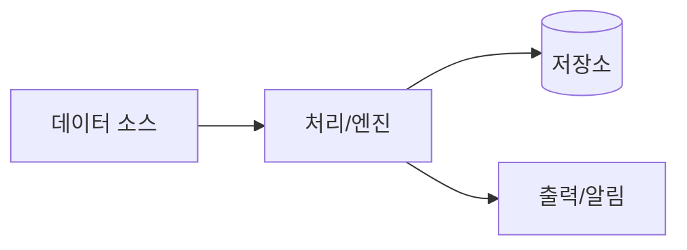

# {{PROJECT_NAME}} 데이터·비즈니스 흐름도

시각 자료. SVG는 `images/` 폴더에 둔다(임베드는 아래).

## 전체 데이터 흐름

![[데이터 흐름도.svg]]

<!-- images/데이터 흐름도.svg 를 생성해 위 임베드가 보이게 한다.
     텍스트로 충분하면 아래 Mermaid를 쓰고, 공유/인쇄가 필요하면 SVG로 내보낸다. -->

## 주요 시퀀스

<!-- 필요 시 images/<주제> 시퀀스.svg 추가 후 임베드 -->

## 관련 문서

- [[구현 계획]] · [[구현 현황]]
